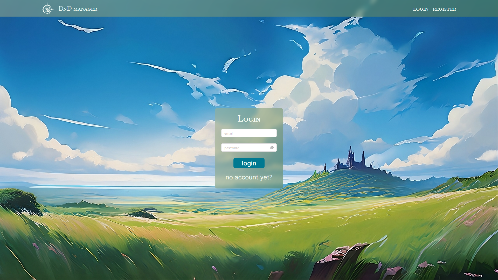
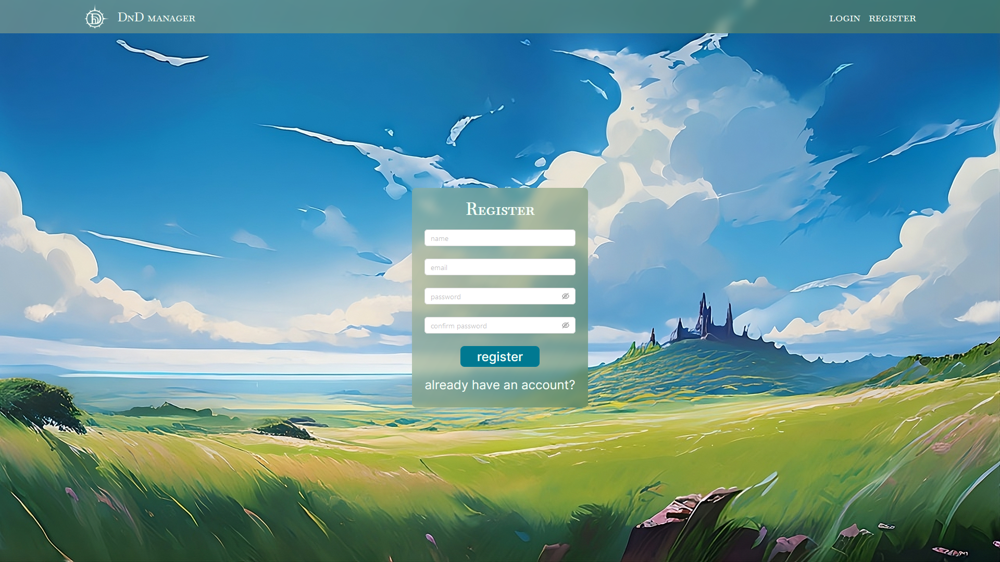
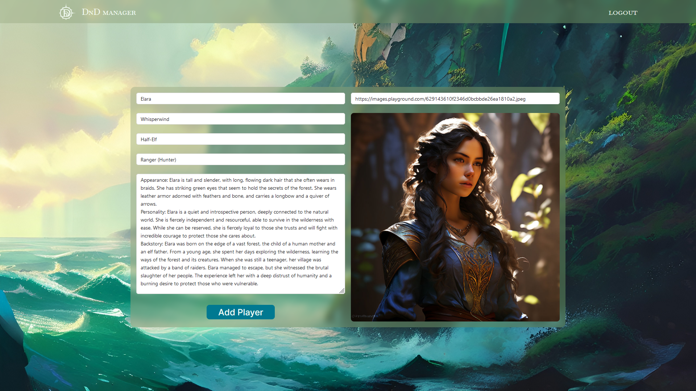
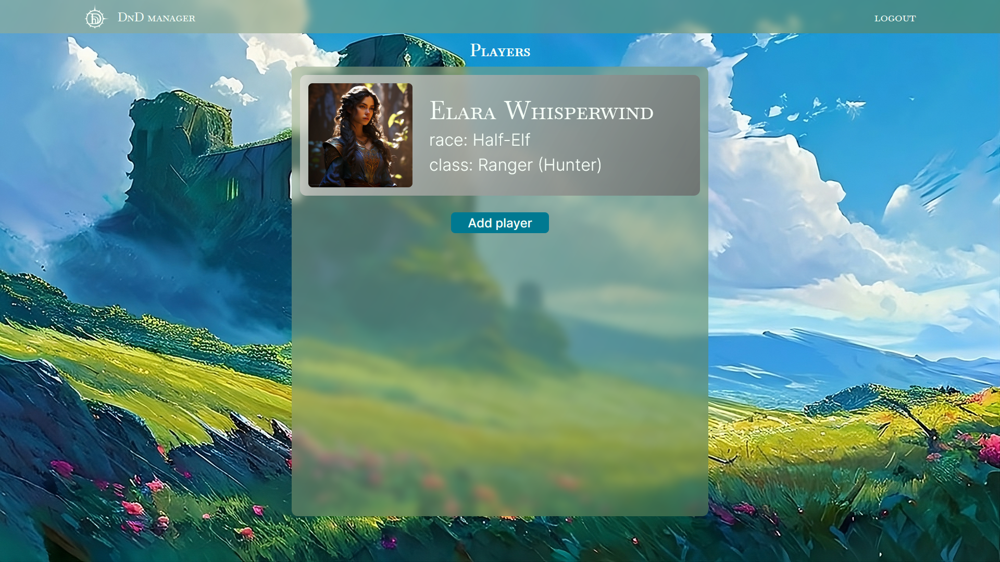

# DnD manager

DnD Manager is a convenient app for managing characters in role-playing games like Dungeons & Dragons, Pathfinder, and others. It provides easy-to-use tools for creating, editing, and tracking characters.

## Table of Contents

* [Getting Started](#getting-started)
* [Features](#features)
* [Usage](#usage)
* [Soon](#soon)

## Getting Started

* `npm install` / `npm i`
* `npm run client-install`
* `npm run dnd-manager`
* Follow the link from the terminal

## Features

* User registration: Create an account and protect your characters from unauthorized access.
* Character creation: Create new characters using a simple and intuitive interface. Fill in their stats, skills, backstory, description, and more.
* Character editing: Easily change the information about your characters at any time. Update their level, stats, skills, and backstory.
* Privacy: Authorized users only see the characters they have created themselves.
* Simple interface: Intuitive and easy-to-use design.

## Usage

* Log in to your account or register a new one to separate the characters.

* Create unique characters with your own story.

* View existing characters, edit them, or delete them.

## Soon
* New design
* Switching color schemes
* New character input fields
* Features
* Abilities
* Inventory and items